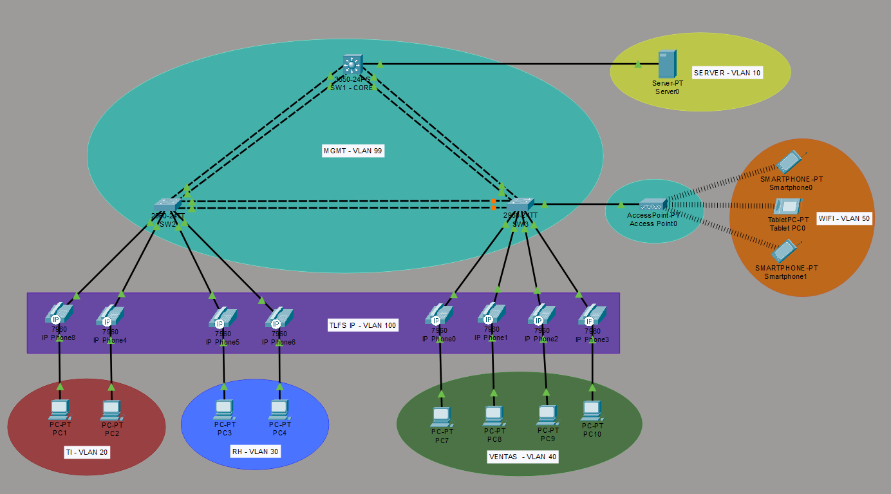
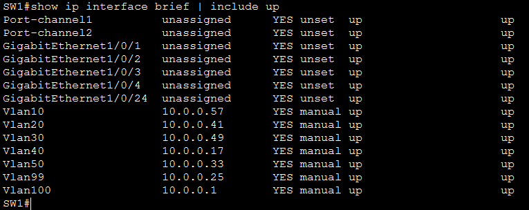
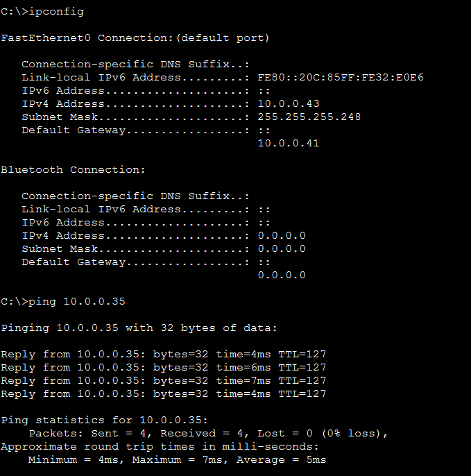

# Enterprise LAN Network — Packet Tracer Lab

Simulated enterprise network built in Cisco Packet Tracer featuring multi-VLAN segmentation, inter-VLAN routing, redundancy, and centralized DHCP. Designed to reflect real-world network infrastructure practices.

---

## Topology

---

## Technologies Implemented

- **VLAN Segmentation** — 7 VLANs segmented by function to isolate traffic and improve security
- **Inter-VLAN Routing** — Layer 3 switch SVIs enabling controlled communication between VLANs
- **VLSM Subnetting** — 10.0.0.0/24 subdivided efficiently based on hosts per VLAN
- **EtherChannel (LACP)** — Dual physical links aggregated for bandwidth and redundancy
- **Rapid PVST+** — Spanning Tree with manually defined root bridge on core switch
- **DHCP Server** — Dedicated server with per-VLAN pools and ip helper-address relay
- **Port Security** — MAC limiting with sticky learning and restrict violation mode
- **PortFast & BPDU Guard** — Fast host connectivity and rogue switch protection
- **Voice VLAN** — Separate VLAN for IP phones on shared access ports
- **SSH Management** — Secure remote access with local authentication and RSA encryption
- **Wireless Access** — AP with dedicated WiFi VLAN isolated from wired infrastructure

---

## VLAN Table

| VLAN | Name | Subnet | Gateway | Mask |
|------|------|--------|---------|------|
| 10 | SERVER | 10.0.0.56/30 | 10.0.0.57 | /30 |
| 20 | TI | 10.0.0.40/29 | 10.0.0.41 | /29 |
| 30 | RH | 10.0.0.48/29 | 10.0.0.49 | /29 |
| 40 | VENTAS | 10.0.0.16/29 | 10.0.0.17 | /29 |
| 50 | WIFI | 10.0.0.32/29 | 10.0.0.33 | /29 |
| 99 | MGMT | 10.0.0.24/29 | 10.0.0.25 | /29 |
| 100 | VOZ | 10.0.0.0/28 | 10.0.0.1 | /28 |

---

## Verification

---

## Future Improvements

- ACLs to restrict inter-VLAN traffic based on security policies
- NAT/PAT with perimeter router for internet simulation
- DHCP Snooping and Dynamic ARP Inspection
- Second SSID for guest network in separate VLAN
- Call Manager for IP phone registration
